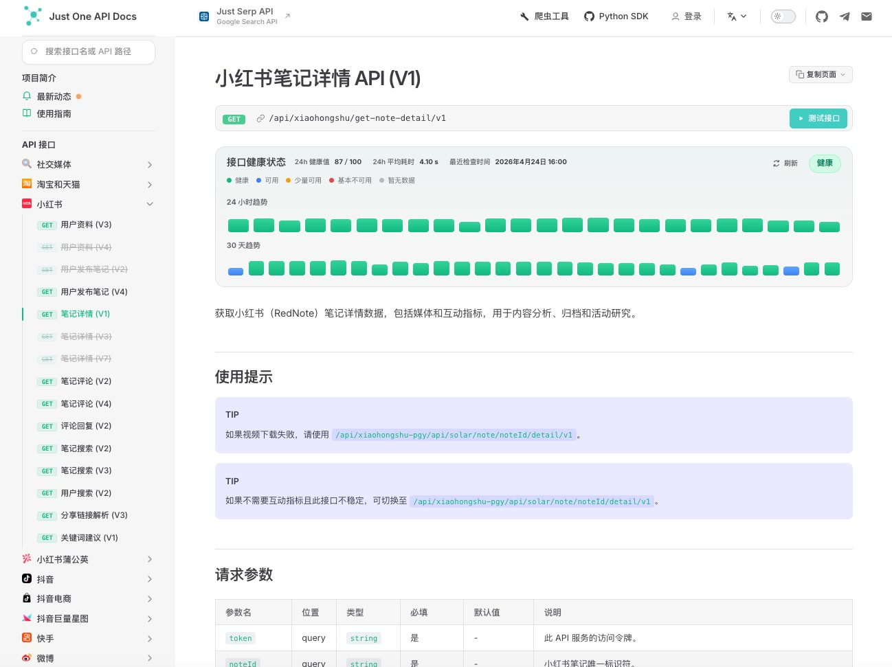

# justoneapi —— 值得信赖的数据合作伙伴 
>[官网](https://justoneapi.com/zh/?utm_source=github.com&utm_medium=referral&utm_campaign=justoneapi_data_api&utm_content=repo_readme) | [接口文档](https://docs.justoneapi.com/zh/?utm_source=github.com&utm_medium=referral&utm_campaign=justoneapi_data_api&utm_content=repo_readme) | [Python SDK](https://github.com/justoneapi/justoneapi-python)

我们是一家专业的数据服务提供商，提供标准的 HTTP 接口服务，并可根据您的需求定制化数据服务。

## 系统概览

文档中心支持查看接口健康状态、版本化 API 路径、请求参数以及各平台的使用提示。

控制台提供 API 令牌管理、余额展示、接口调用记录、调用量趋势和消费金额分析。

## 联系方式

如有任何问题，欢迎联系我们。

[联系我们](https://justoneapi.com/zh/contact?utm_source=github.com&utm_medium=referral&utm_campaign=justoneapi_data_api&utm_content=repo_readme)

## 服务概览

完整请求参数和响应说明请以在线接口文档为准。

<!-- API_LIST_START -->

### 社交媒体

- 跨平台搜索 (V1)

### 淘宝和天猫

- 商品详情 (V1)
- 商品详情 (V4)
- 商品详情 (V5)
- 商品详情 (V9)
- 商品评价 (V3)
- 店铺商品列表 (V1)
- 店铺商品列表 (V2)
- 店铺商品列表 (V3)
- 商品搜索 (V1)

### 小红书

- 用户资料 (V3)
- 用户资料 (V4)（已弃用）
- 用户发布笔记 (V2)（已弃用）
- 用户发布笔记 (V4)
- 笔记详情 (V1)
- 笔记详情 (V3)（已弃用）
- 笔记详情 (V7)（已弃用）
- 笔记评论 (V2)
- 笔记评论 (V4)
- 评论回复 (V2)
- 笔记搜索 (V2)
- 笔记搜索 (V3)
- 用户搜索 (V2)
- 分享链接解析 (V3)
- 关键词建议 (V1)

### 小红书蒲公英

- 创作者资料 (V1)
- 数据摘要 (V1)
- 粉丝增长历史 (V1)
- 粉丝摘要 (V1)
- 相似创作者 (V1)
- 创作者特征标签 (V1)
- 创作者内容标签 (V1)
- 笔记表现指标 (V1)
- 用户发布笔记 (V1)
- 粉丝分布 (V1)
- 成本效益分析 (V1)
- 笔记详情 (V1)
- 创作者搜索 (V1)
- 创作者核心指标 (V1)
- 创作者资料 (V1)（已弃用）
- 笔记表现指标 (V1)（已弃用）
- 粉丝分布 (V1)（已弃用）
- 粉丝摘要 (V1)（已弃用）
- 粉丝增长历史 (V1)（已弃用）
- 创作者笔记列表 (V1)
- 数据摘要 (V2)（已弃用）
- 成本效益分析 (V1)（已弃用）
- 笔记详情 (V1)（已弃用）
- 创作者核心指标 (V1)（已弃用）

### 抖音

- 用户资料 (V3)
- 用户发布视频 (V3)
- 视频详情 (V2)
- 视频搜索 (V4)
- 用户搜索 (V2)
- 视频评论 (V1)
- 评论回复 (V1)
- 分享链接解析 (V1)

### 抖音电商

- 商品详情 (V1)

### 抖音巨量星图

- 创作者资料 (V1)
- 创作者链接结构 (V1)
- 创作者可见性状态 (V1)
- 创作者渠道指标 (V1)
- 创作者订单经验 (V1)
- 创作者链接指标 (V1)
- 视频分布 (V1)
- 受众分布 (V1)
- 营销指标 (V1)
- 传播指标 (V1)
- 转化分析 (V1)
- 展示商品 (V1)
- 转化资源 (V1)
- 性价比分析 (V1)
- 受众触点分布 (V1)
- 推荐视频 (V1)
- 粉丝分布 (V1)
- 创作者搜索 (V1)
- 商品报告趋势 (V1)
- 商品报告详情 (V1)
- 商品报告分析 (V1)
- KOL 评论关键词分析 (V1)
- 粉丝增长趋势 (V1)
- KOL 内容关键词分析 (V1)
- 作者商业传播信息 (V1)
- 作者商业种草基础信息 (V1)
- 创作者资料 (V1)（已弃用）
- 受众分布 (V1)（已弃用）
- 粉丝分布 (V1)（已弃用）
- 营销指标 (V1)（已弃用）
- 传播指标 (V1)（已弃用）
- KOL 关键词搜索 (V1)
- 转化分析 (V1)（已弃用）
- 展示商品 (V1)（已弃用）
- 创作者链接指标 (V1)（已弃用）
- 转化资源 (V1)（已弃用）
- 创作者链接结构 (V1)（已弃用）
- 受众触点分布 (V1)（已弃用）
- 性价比分析 (V1)（已弃用）
- 推荐视频 (V1)（已弃用）
- 粉丝增长趋势 (V1)（已弃用）
- KOL 评论关键词分析 (V1)（已弃用）
- KOL 内容关键词分析 (V1)（已弃用）
- 作者商业传播信息 (V1)（已弃用）
- 作者商业种草基础信息 (V1)（已弃用）
- 视频详情 (V1)（已弃用）

### 快手

- 用户搜索 (V2)
- 用户发布视频 (V2)
- 视频详情 (V2)
- 视频搜索 (V2)
- 用户资料 (V1)
- 分享链接解析 (V1)
- 视频评论 (V1)

### 微博

- 关键词搜索 (V2)
- 帖子详情 (V1)
- 用户资料 (V3)
- 用户粉丝 (V1)
- 用户关注者 (V1)
- 用户发布帖子 (V1)
- 用户视频列表 (V1)
- 电视视频详情 (V1)
- 热搜 (V1)
- 帖子评论 (V1)
- 搜索用户发布帖子 (V1)

### 哔哩哔哩

- 视频详情 (V2)
- 用户发布视频 (V2)
- 用户资料 (V2)
- 视频弹幕 (V2)
- 视频评论 (V2)
- 视频搜索 (V2)
- 分享链接解析 (V1)
- 用户关系统计 (V1)
- 视频字幕 (V2)

### 京东

- 商品详情 (V1)
- 商品评论 (V1)
- 店铺商品列表 (V1)

### 微信公众号

- 用户发布帖子 (V1)
- 文章互动指标 (V1)
- 文章评论 (V1)
- 关键词搜索 (V1)
- 文章详情 (V1)

### 豆瓣电影

- 影评 (V1)
- 评价详情 (V1)
- 条目详情 (V1)
- 评论 (V1)
- 近期热门电影 (V1)
- 近期热门电视剧 (V1)

### TikTok

- 用户发布帖子 (V1)
- 帖子详情 (V1)
- 用户资料 (V1)
- 帖子评论 (V1)
- 评论回复 (V1)
- 用户搜索 (V1)
- 作品搜索 (V1)

### TikTok Shop

- 商品搜索 (V1)
- 商品详情 (V1)

### 优酷

- 视频搜索 (V1)
- 视频详情 (V1)
- 用户资料 (V1)

### Instagram

- 用户资料 (V1)
- 帖子详情 (V1)
- 用户发布帖子 (V1)
- Reels 搜索 (V1)
- 话题标签帖子搜索 (V1)

### YouTube

- 视频详情 (V1)
- 频道视频 (V1)

### Reddit

- 帖子详情 (V1)
- 帖子评论 (V1)
- 关键词搜索 (V1)

### 今日头条

- 文章详情 (V1)
- 用户资料 (V1)
- App关键词搜索 (V1)（已弃用）
- 网页关键词搜索 (V2)

### 知乎

- 专栏文章详情 (V1)
- 回答列表 (V1)
- 关键词搜索 (V1)
- 专栏文章列表 (V1)

### 亚马逊

- 商品详情 (V1)
- 商品热门评论 (V1)
- 热销商品 (V1)
- 按类别获取商品 (V1)

### Facebook

- 作品搜索 (V1)
- 获取资料ID (V1)
- 获取资料帖子 (V1)

### Twitter

- 用户资料 (V1)
- 用户发布帖子 (V1)

### 贝壳

- 二手房详情 (V1)
- 二手房列表 (V1)
- 小区列表 (V1)

### IMDb

- 发行预期 (V1)
- 扩展详情 (V1)
- 主要演员和工作人员 (V1)
- 基本信息 (V1)
- Redux概览 (V1)
- '你知道吗'洞察 (V1)
- 影评人评论摘要 (V1)
- 奖项摘要 (V1)
- 用户评价摘要 (V1)
- 剧情摘要 (V1)
- 贡献问题 (V1)
- 详情 (V1)
- 票房摘要 (V1)
- 推荐 (V1)
- 关键词搜索 (V1)
- 流媒体精选 (V1)
- 分类新闻 (V1)
- 榜单排名 (V1)
- 原产国 (V1)

### 网页

- HTML内容 (V1)
- 渲染的HTML内容 (V1)
- Markdown内容 (V1)

<!-- API_LIST_END -->
